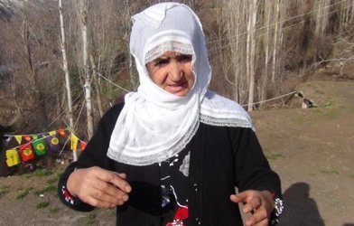

# Multi-CAST Northern Kurdish

## How to cite

If you use these data please cite
- the original source
  > Haig, Geoffrey & Vollmer, Maria & Thiele, Hanna. 2015. Multi-CAST Northern Kurdish. In Haig, Geoffrey & Schnell, Stefan (eds.), Multi-CAST: Multilingual corpus of annotated spoken texts. Version 1505. Bamberg: University of Bamberg. (multicast.aspra.uni-bamberg.de/#nkurd) (date accessed)
- the derived dataset using the DOI of the [particular released version](../../releases/) you were using



## Description


**Northern Kurdish** ([nort2641](https://glottolog.org/resource/languoid/id/nort2641)), also known as Kurmanjî, is a Northwest Iranian language spoken in eastern Turkey, Iraq, Syria, and parts of western Iran. The three texts recorded here are traditional narratives, from a female and a male speaker who grew up near the townships of Erzurum and Muš, respectively.

The texts were recorded in Germany in the late 1990s and early 2000s, and subsequently transcribed, translated, and annotated for Multi-CAST by Geoffrey Haig, Abdullah Incekan, Hanna Thiele, and Maria Vollmer. A [description of the language](MediaTable#cldf:Haig2018_Northern-Kurdish_Kurmanji.pdf) can be found in [Haig (2018)](Source#cldf:haig2018).

The texts in this corpus (version 2207) also make up a part of the [Northern Kurdish data set](https://doreco.huma-num.fr/languages/nort2641) in [DoReCo](https://doreco.huma-num.fr/), which has been time-aligned at the phone level.

This dataset is licensed under a CC-BY-4.0 license

Available online at https://multicast.aspra.uni-bamberg.de/#nkurd


```geojson
{
    "type": "FeatureCollection",
    "features": [
        {
            "type": "Feature",
            "geometry": {
                "type": "Point",
                "coordinates": [
                    43.0,
                    37.0
                ]
            }
        },
        {
            "type": "Feature",
            "geometry": {
                "type": "Polygon",
                "coordinates": [
                    [
                        [
                            38.0,
                            42.0
                        ],
                        [
                            48.0,
                            42.0
                        ],
                        [
                            48.0,
                            32.0
                        ],
                        [
                            38.0,
                            32.0
                        ],
                        [
                            38.0,
                            42.0
                        ]
                    ]
                ]
            }
        }
    ]
}
```


## Corpus counts

Only a small number of basic GRAID symbols are counted:

*Function symbols*
- ⟨0⟩ zero
- ⟨pro⟩ definite pronoun
- ⟨np⟩ full noun phrase
- ⟨other⟩ form not further specified

*Person/Animacy symbols*
- ⟨.1⟩ first person
- ⟨.2⟩ second person
- ⟨.h⟩ third person, human
- ⟨.d⟩ third person, anthropomorphic
- ø third person, non-human

*Function symbols*
- ⟨:s⟩ subject of an intransitive clause
- ⟨:a⟩ subject of a transitive clause
- ⟨:ncs⟩ non-canonical subject
- ⟨:p⟩ direct object
- ⟨:obl⟩ oblique argument
- ⟨:g⟩ goal argument
- ⟨:l⟩ locational argument
- ⟨:pred⟩ predicate
- ⟨:poss⟩ possessive
- ⟨:other⟩ function not further specified

Only basic categories are listed; categories represented by complex symbols with additional
specifiers (e.g. ⟨dem_pro⟩ ‘demonstrative pronoun’) have been subsumed under the more basic
category (e.g. ⟨pro⟩ ‘definite pronoun’). Please refer to the annotation notes for this corpus for
information on all annotated categories, including those not listed here.

| GRAID | ⟨:s⟩ | ⟨:a⟩ | ⟨:ncs⟩ | ⟨:p⟩ | ⟨:obl⟩ | ⟨:g⟩ | ⟨:l⟩ | ⟨:pred⟩ | ⟨:poss⟩ | ⟨:other⟩ | totals |
|:--------------|-------:|-------:|---------:|-------:|---------:|-------:|-------:|----------:|----------:|-----------:|---------:|
| **⟨0.1⟩** | 8 | 19 | 0 | 11 | 0 | 1 | 0 | 0 | 0 | 0 | 39 |
| **⟨0.2⟩** | 13 | 18 | 0 | 0 | 0 | 0 | 0 | 0 | 0 | 0 | 31 |
| **⟨0.h⟩** | 233 | 200 | 0 | 44 | 0 | 0 | 0 | 0 | 1 | 0 | 478 |
| **⟨0.d⟩** | 2 | 0 | 0 | 0 | 0 | 0 | 0 | 0 | 0 | 0 | 2 |
| **⟨0⟩** | 43 | 7 | 0 | 82 | 0 | 2 | 0 | 0 | 0 | 0 | 134 |
| **⟨pro.1⟩** | 67 | 70 | 0 | 11 | 16 | 11 | 0 | 0 | 69 | 0 | 244 |
| **⟨pro.2⟩** | 41 | 30 | 0 | 6 | 11 | 10 | 0 | 0 | 21 | 0 | 119 |
| **⟨pro.h⟩** | 41 | 22 | 0 | 9 | 31 | 18 | 0 | 0 | 138 | 3 | 262 |
| **⟨pro.d⟩** | 0 | 0 | 0 | 0 | 0 | 0 | 0 | 0 | 0 | 0 | 0 |
| **⟨pro⟩** | 3 | 0 | 0 | 7 | 6 | 6 | 7 | 0 | 13 | 0 | 42 |
| **⟨np.1⟩** | 0 | 0 | 0 | 0 | 0 | 0 | 0 | 0 | 0 | 0 | 0 |
| **⟨np.2⟩** | 0 | 0 | 0 | 0 | 0 | 0 | 0 | 0 | 0 | 0 | 0 |
| **⟨np.h⟩** | 86 | 40 | 0 | 22 | 28 | 21 | 1 | 32 | 75 | 25 | 330 |
| **⟨np.d⟩** | 1 | 0 | 0 | 0 | 0 | 0 | 0 | 0 | 0 | 0 | 1 |
| **⟨np⟩** | 121 | 6 | 0 | 211 | 33 | 113 | 59 | 30 | 37 | 45 | 655 |
| **⟨other.1⟩** | 0 | 0 | 0 | 0 | 0 | 0 | 0 | 0 | 0 | 0 | 0 |
| **⟨other.2⟩** | 0 | 0 | 0 | 0 | 0 | 0 | 0 | 0 | 0 | 0 | 0 |
| **⟨other.h⟩** | 0 | 0 | 0 | 1 | 1 | 0 | 0 | 0 | 0 | 0 | 2 |
| **⟨other.d⟩** | 0 | 0 | 0 | 0 | 0 | 0 | 0 | 0 | 0 | 0 | 0 |
| **⟨other⟩** | 1 | 1 | 0 | 14 | 0 | 27 | 11 | 87 | 2 | 0 | 143 |
| | 660 | 413 | 0 | 418 | 126 | 209 | 78 | 149 | 356 | 73 | 2482 |


**Clause boundaries**

| GRAID | count |
|:-----------|--------:|
| **⟨##⟩** | 271 |
| **⟨#⟩** | 832 |
| **totals** | 1103 |


## Corpus metadata

- [Annotation notes](cldf/media/annotation-notes.pdf)
- [Metadata](cldf/media/metadata.pdf)
- [Translated texts](cldf/media/translated-texts.pdf)
- [Haig2018_northern kurdish_kurmanji](cldf/media/Haig2018_Northern-Kurdish_Kurmanji.pdf)


## CLDF Datasets

The following CLDF datasets are available in [cldf](cldf):

- CLDF [TextCorpus](https://github.com/cldf/cldf/tree/master/modules/TextCorpus) at [cldf/TextCorpus-metadata.json](cldf/TextCorpus-metadata.json)